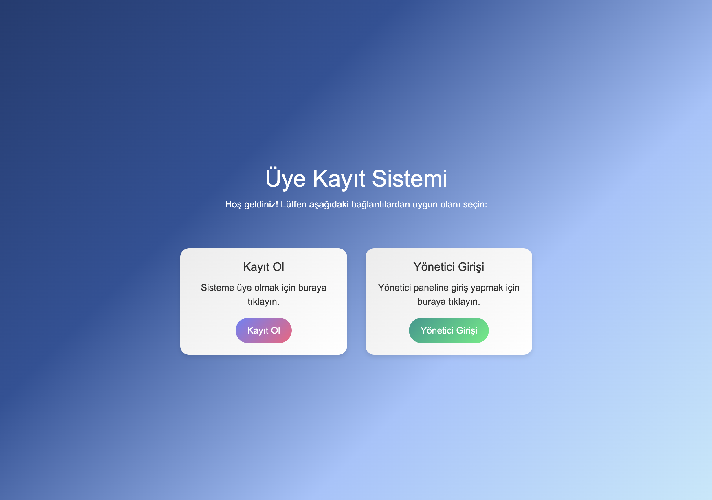

# MemberRegistrationSystem
A comprehensive membership registration system built with [technology stack] for managing user sign-ups, authentication, and profile management.

# Membership Registration System

A comprehensive membership registration system built with [technology stack] for managing user sign-ups, authentication, and profile management.

## Features

- User sign-up
- User login
- Profile management
- Password reset

## Technologies Used

- Frontend: HTML, CSS, JavaScript
- Backend: PHP
- Database: MySQL
- Authentication: --

## Screenshots

### Home Page

### Sign-Up Page

### Login Page

### Profile Page

## Usage

1. Open your web browser and go to `http://localhost:[port]`.
2. Sign up for a new account or log in if you already have one.
3. Manage your profile through the profile page.

## Contributing

We welcome contributions! Please follow these steps:

1. Fork the repository.
2. Create a new branch (`git checkout -b feature-branch`).
3. Make your changes.
4. Commit your changes (`git commit -m 'Add some feature'`).
5. Push to the branch (`git push origin feature-branch`).
6. Create a new Pull Request.

## License

This project is licensed under the MIT License.

## Contact

If you have any questions, feel free to reach out at [tubayalvacc@gmail.com].

---

